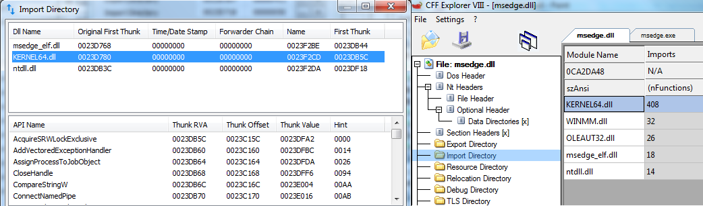

# API-MS-WIN_XP
## WARNING!
First of all, it is necessary to have disassembling skills and knowledge of [**Microsoft Windows PE COFF executable file format**](https://learn.microsoft.com/en-us/windows/win32/debug/pe-format). To edit .exe/.dll the import table (NT_IMPORT_TABLE) you will need tools like:
* [**PETools**](https://github.com/petoolse/petools)
* [CFFExlorer](https://ntcore.com/?page_id=388)
* [x64dbg](https://github.com/x64dbg/x64dbg)
* [Dependency Walker](https://www.dependencywalker.com/)
	
*As a minimal example, you should rewrite a typical KERNE32.DLL into your own implementation of Kernel64.dll*:


*Use Dependency Walker for determine absent WinAPIs in Windows 7 system (KERNE32.DLL, red **C** flag, GetProcessMitigationPolicy/PrefetchVirtualMemory/SetProcessMitigationPolicy/SetThreadInformation) :*
")

### Microsoft API system libs Windows 11/10/8/ from Windows XP/7  
  
- API-MS-WIN-CORE-HANDLE-L1-1-0
- API-MS-WIN-CORE-LIBRARYLOADER-L1-2-0
- API-MS-WIN-CORE-REALTIME-L1-1-1
- API-MS-WIN-CORE-WINRT-ERROR-L1-1-0  
- API-MS-WIN-CORE-WINRT-L1-1-0   
- API-MS-WIN-CORE-WINRT-STRING-L1-1-0   
- API-MS-WIN-POWER-BASE-L1-1-0   
- API-MS-WIN-SHCORE-SCALING-L1-1-1   
- msvproc
- kernel64  
- netapi64
- user64
- userenx
- WinXttp
- wldp
- xcryptprimitives
- Xfplat

## linker_export
Simple: after link you DLL (*kernel64, API-MS-WIN-CORE-HANDLE-L1-1-0, user64, WinXttp ...*) in MSVC (or you choose) set the latest command -   
`linker_export.exe "kernel64.dll"`  

More technical info:  
**1)** We cannot directly compile DLLs with exported functions whose names are already written in the original Microsoft system dll-libraries. 
For example, WinAPI `GetProcessMitigationPolicy`, `CreateFileA` from %SYSTEMROOT%\System32\kernel32.dll and so on.  
**2)** Also, we cannot take the same system library name (e.g. kernel32) for our library to use without editing the PE COFF export table.

To solve the first problem (1), we mark the exported functions in our library with a special marker (lower **_** dash).  
`_GetProcessMitigationPolicy`.  
is a sign for linker_export that the name of the specified function should be renamed (remove the marker) to get the original name `GetProcessMitigationPolicy`.  
At the same time linker_export removes unnecessary characters such as **@** that are left after x86 (32-bit compiler). On the output we get a correct name of the exported function, which is correctly recognized during initial library loading and after `GetProcAddress()` call.  
To solve the second problem, we need to assign a name different from the name of the source system library: `kernel64.dll` instead of **kernel32.dll**. In this case, our library `kernel64.dll` performs the following functions
* proxy/bridged functions into the original system library "%SYSTEMROOT%\System32\kernel32.dll". This requires editing of the Chrome/EDGE/Opera/Spotify import table, etc.*  
* substitutes or emulates WinAPI exported functions missing in Windows 7 such as `GetProcessMitigationPolicy`, `SetThreadInformation`, `GetFirmwareType` and so on.

## kernel64 fixes SANDBOX 
* [CreateFileMappingW](https://learn.microsoft.com/en-us/windows/win32/api/memoryapi/nf-memoryapi-createfilemappingw)
```
      std::u16string name;
  if (win::GetVersion() < win::Version::WIN8_1) {
    // Windows < 8.1 ignores DACLs on certain unnamed objects (like shared
    // sections). So, we generate a random name when we need to enforce
    // read-only.
	/*
	Windows < 8.1 игнорирует DACL для некоторых неименованных объектов (like shared sections). 
	Поэтому мы генерируем случайное имя, когда нам нужно обеспечить только для чтения.
	
    uint64_t rand_values[4];
    RandBytes(&rand_values, sizeof(rand_values));
    name = ASCIIToUTF16(StringPrintf("CrSharedMem_%016llx%016llx%016llx%016llx",
        rand_values[0], rand_values[1],
        rand_values[2], rand_values[3]));
    DCHECK(!name.empty());
}
```
* **MPFLAT/WLDP** preloader func. WLDP.dll for from MS EDSGE;
* **DDRAW_FontCase_Service_SANDBOX_hook()** - fixed fails in Windows 7 DirectDRAW (*DDRAW.DLL*)  `public: static bool cdecl ClientSideConnection::StartFontCacheService(unsigned int)`
* WinAPI ***UpdateProcThreadAttribute*** must be fixed manually in the assembly binary code;

## Features table
| Library Name | Bridged to %SYSTEMROOT%\System32\... | EXPORT_TABLE |
| ------ | ------ |------ |
| API-MS-WIN-CORE-HANDLE-L1-1-0 | ❌ | CompareObjectHandles |
| API-MS-WIN-CORE-LIBRARYLOADER-L1-2-0 | kernel32.dll | ❓*{skip_entrys.cpp}* | 
| API-MS-WIN-CORE-REALTIME-L1-1-1 | ❌ |  QueryUnbiasedInterruptTimePrecise |
| API-MS-WIN-CORE-WINRT-ERROR-L1-1-0 | ❌ | RoOriginateError, RoTransformError, ... |
| API-MS-WIN-CORE-WINRT-L1-1-0    | ❌ | RoActivateInstance,GetActivationFactory,RoGetActivationFactory, ... |
| API-MS-WIN-CORE-WINRT-STRING-L1-1-0 | ❌ | HSTRING_UserMarshal,... |
| API-MS-WIN-POWER-BASE-L1-1-0 | ❌ | CallNtPowerInformation,PowerDeterminePlatformRoleEx |
| API-MS-WIN-SHCORE-SCALING-L1-1-1 | ❌ | GetDpiForMonitor, SetProcessDpiAwareness, GetScaleFactorForMonitor |
| msvproc | ❓ |  |
| kernel64 | kernel32.dll | DiscardVirtualMemory, PrefetchVirtualMemory, SetThreadInformation, GetProcessMitigationPolicy,SetProcessMitigationPolicy, Wow64GetThreadContext, GetPackageFamilyName,... |
| netapi64 | netapi32.dll | NetGetAadJoinInformation, NetFreeAadJoinInformation |
| user64 | user32.dll | GetPointerPenInfo, GetPointerType, RegisterSuspendResumeNotification, GetDpiForWindow, PhysicalToLogicalPointForPerMonitorDPI, GetPointerInputTransform,...  |
| userenx | userenv.dll | CreateAppContainerProfile,DeriveAppContainerSidFromAppContainerName |
| WinXttp | WinHttp.dll | WinHttpCreateProxyResolver, WinHttpFreeProxyResult, WinHttpGetProxyForUrlEx, WinHttpGetProxyResult |
| wldp | ❌ | WldpQueryWindowsLockdownMode |
| xcryptprimitives | bcryptprimitives.dll | ProcessPrng |
| Xfplat | Mfplat.dll | MFCreateDXGIDeviceManager, MFCreateDXGISurfaceBuffer,MFLockDXGIDeviceManager, MFUnlockDXGIDeviceManager |

**Nice hunt!**
ELF/80_PA
